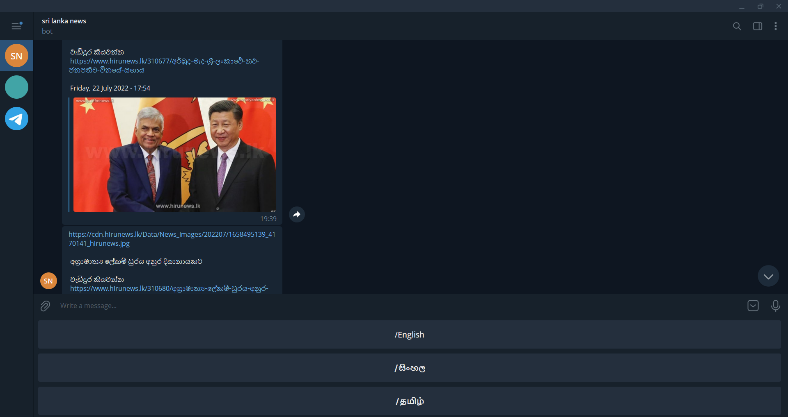
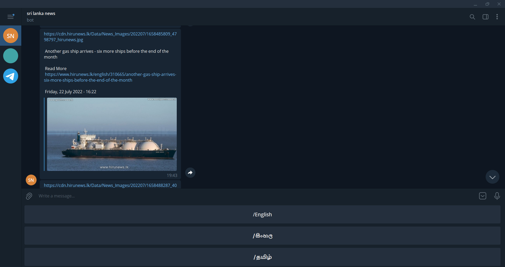
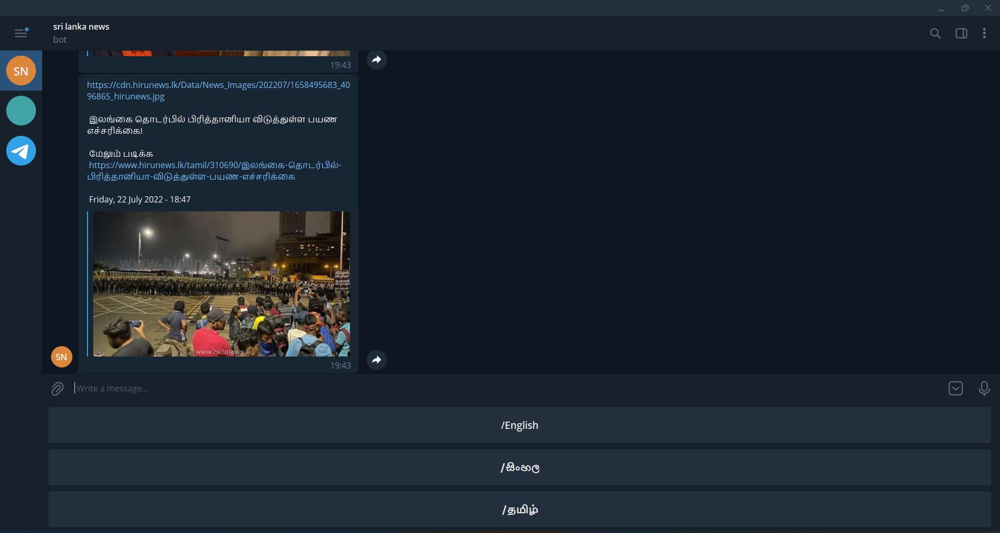

# Sri-Lanka-News-Telegram-Bot

Sri Lanka news telegram bot

This telegram bot provide news in Sinhala, Tamil and English languages.

Project description

Scraping news website and organizing news data and sent that news to telegram.

This Project use hirunews website.

Used packages:

node-telegram-bot-api, axios, cheerio, dotenv, nodemon

Project Demo:

Go to this Link for awake heroku news telegram bot.

<a href="https://sl-news-telegrambot.herokuapp.com/" target="_blank">https://sl-news-telegrambot.herokuapp.com/</a>

After that Run news telegram bot in telegram.

<a href="https://t.me/DailyNewsForSriLanka_bot" target="_blank">https://t.me/DailyNewsForSriLanka_bot</a>

 
 
 
